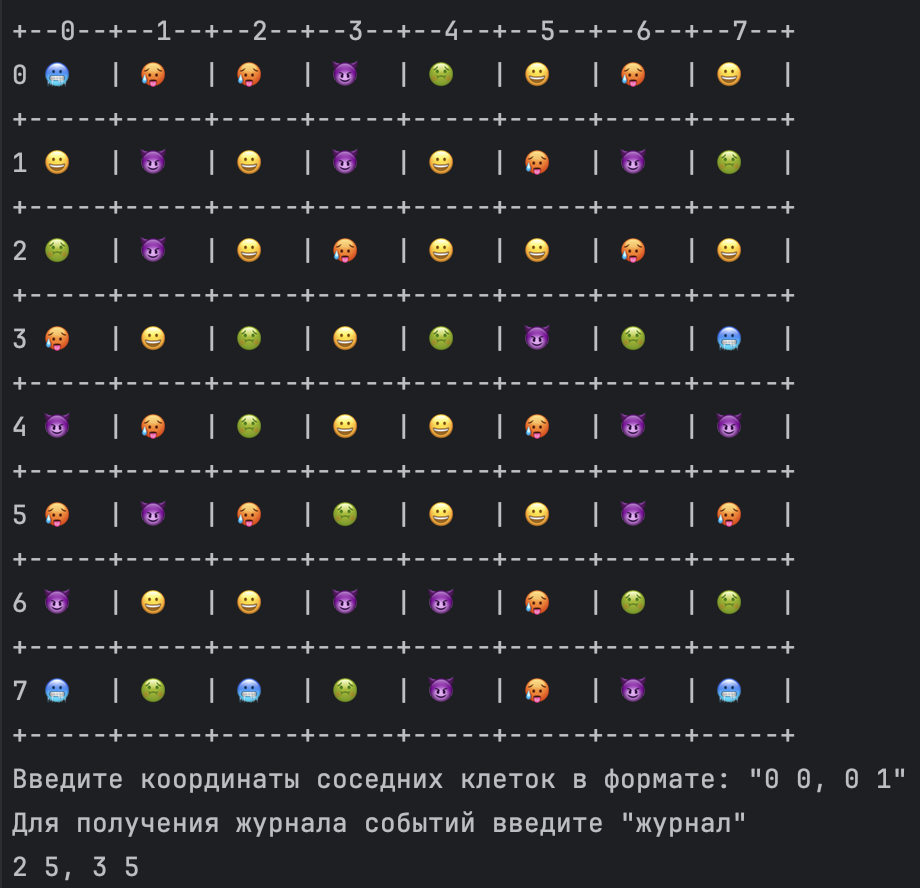
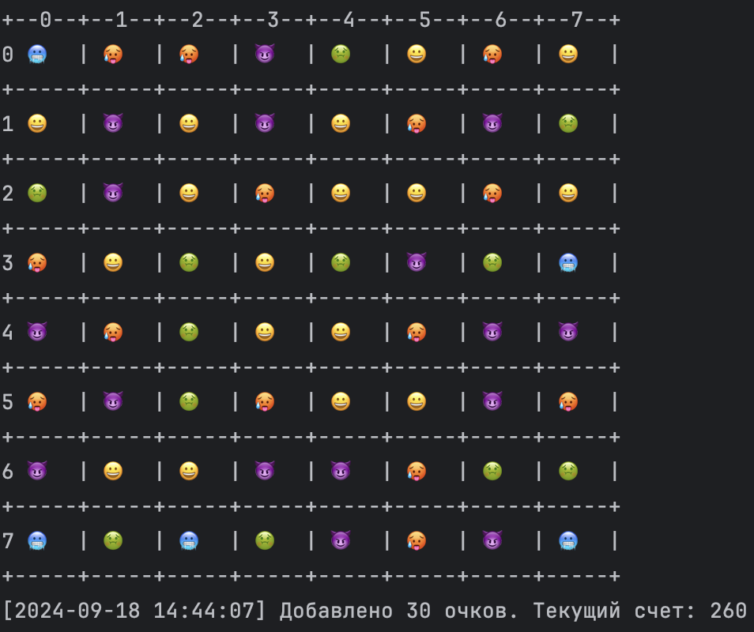
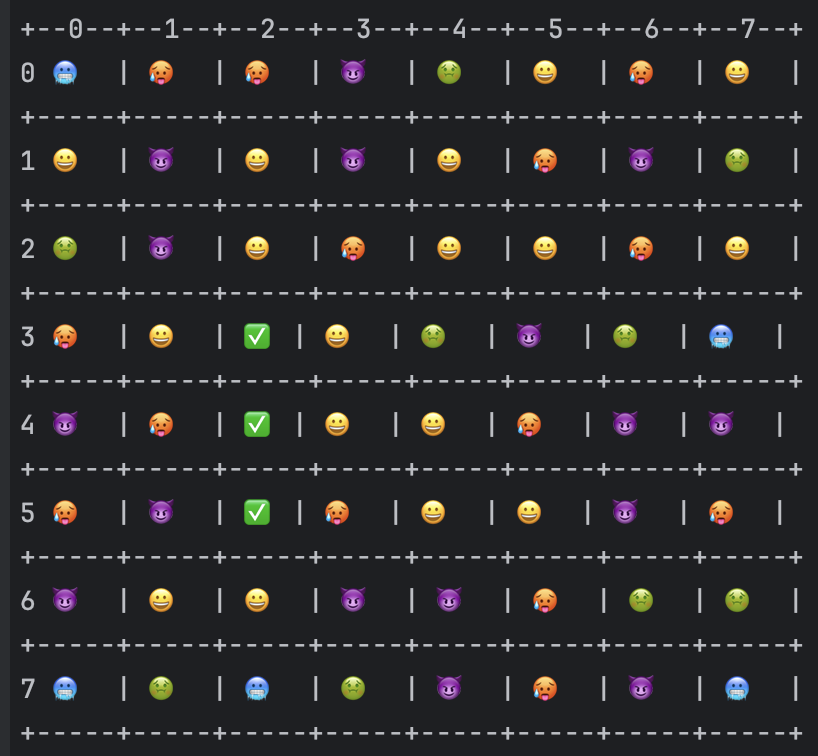

# Консольная реализация игры 3 в ряд

## Для запуска - `go run main.go`

### Управление происходит за счет ввода с клавиатуры координат двух соседних ячеек

### Для набора очков находите комбинации из трех одинаковых элементов по вертикали или горизонтали.

### Если комбинация состоит из 4х и более элементов, начисляются дополнительные очки по формуле (n - 2) * 10

### Игра заканчивается, если на поле не остается доступных ходов

